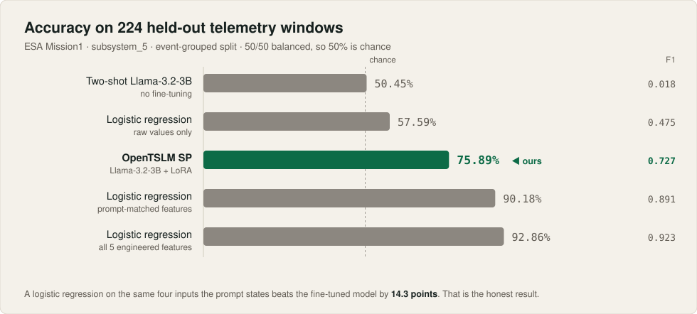
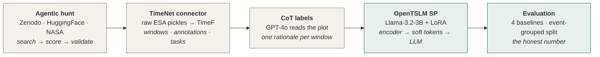
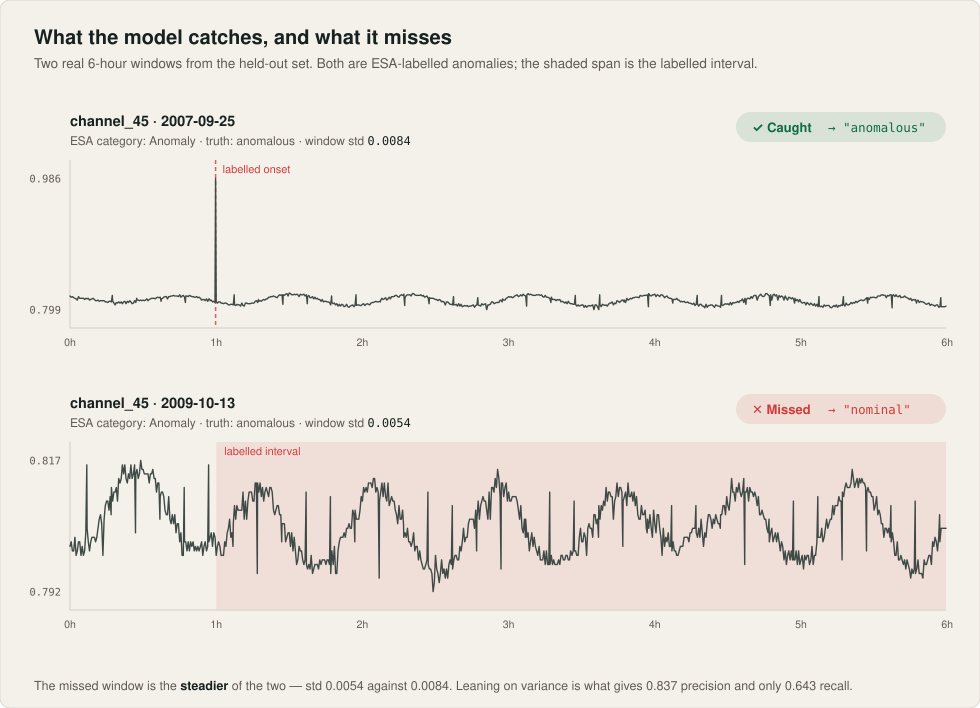
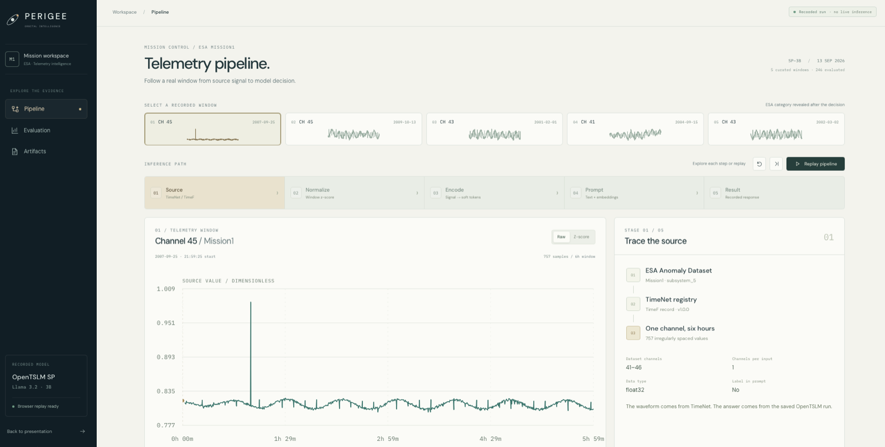

<div align="center">


# Perigee

**Plain-language triage for spacecraft telemetry.**

A time-series language model that reads six hours of raw ESA satellite telemetry
and answers the only question an operations engineer actually has — *does this
window need a human?* — in a sentence they can act on.

[](https://zenodo.org/records/12528696)
[](https://arxiv.org/abs/2510.02410)
[](https://github.com/OpenTSLM/TimeNet)
[](LICENSE)

Built at the **Temporal AI Challenge** — Aionic Labs × ETH Agentic Systems Lab,
European Hackathon League, Zurich, 12–13 September 2026.

**[Jury pitch deck (PDF)](docs/perigee-jury-pitch.pdf)** · **[Evaluation
record](docs/RESULTS.md)** · **[Mission Control demo](#mission-control)**

</div>

---

## At a glance

|  |  |
|---|---|
| **What it does** | Reads six hours of real ESA satellite telemetry and says, in plain language, whether the window needs a human — not just a threshold flag. |
| **The result** | **75.89%** accuracy on a leak-free split. A logistic regression on the same four inputs gets **90.18%**. We lead with the baseline's win, because it is the true one. |
| **Why trust it** | We found a data leak *in our own split*, fixed it, and reported the 11-point drop it had been hiding. Every prediction on all 224 test windows is published. |
| **What's here** | A reusable [TimeNet connector](TimeNet/packages/timenet-connectors/src/timenet_connectors/datasets/esa/mission1_subsystem5/connector.py), an [agentic dataset hunter](pipeline/step1_hunt/), four baselines, a [Next.js replay demo](#mission-control), and an [evaluation record](docs/RESULTS.md) that keeps the runs that failed. |



---

## The problem

On 30 January 2026, SpaceX applied for permission to launch and operate up to
**one million satellites**. Every one of them streams telemetry that somebody,
eventually, has to look at.

The failures that end missions are rarely dramatic. They are small, early, and
easy to miss:

| | |
|---|---|
| **59%** | of 156 on-orbit failures (1980–2005) traced to attitude/orbit control and power systems — *Tafazoli, Fig. 1* |
| **$4.4B** | reported losses from power-related failures across 64 incidents (1990–2006) — *Landis et al., 2006* |

Anomaly detectors already exist, and they output a flag. A flag tells an
operator that *something* crossed a threshold. It does not tell them what
changed, whether a telecommand explains it, or whether this is worth waking
someone up for. That gap — between a flag and a decision — is what Perigee
tries to close.

**Our task:** given one channel, one six-hour window, flag whether it needs
closer inspection, and say why in plain language.

---

## What we built

Five stages, end to end, on real ESA telemetry.



**The data.** ESA Anomaly Dataset (ESA-AD) Mission1, subsystem_5 — channels
41–46, the ESA-ADB benchmark's own "lightweight subset". Each labeled anomaly
interval becomes a six-hour window (one hour of context before the labeled
start, five after), paired 1:1 with a matched nominal window from the same
channel and split, so the model never trains on the raw stream's ~1.8% anomaly
rate.

**What the model sees.** The normalized window goes to the time-series encoder
as soft tokens. Two things go in as text: the window's mean and standard
deviation, and whether a priority ≥ 2 telecommand fired in the preceding six
hours. That telecommand signal is nearly free and does real work — over half of
ESA's *Rare Events* on these channels follow a command within five minutes,
versus essentially none of the true *Anomalies*.

**What it says back.** A paragraph of reasoning ending in `Answer: nominal` or
`Answer: anomalous`. Here is a real one, verbatim, from a window it got right:

> The telemetry data from channel_46 exhibits a pattern that initially appears
> relatively stable, maintaining a consistent level around 0.40 for the first
> hour. However, a noticeable spike occurs just after the one-hour mark, where
> the value abruptly rises above 0.60, indicating a significant deviation from
> the initial trend. […] The presence of these spikes and the increased
> variability post-spike suggest a drift from the initial stable trend, which
> is unusual for this subsystem.
>
> **`Answer: anomalous`** ✓ *(ESA category: Anomaly)*

---

## Results

All numbers on the same **224-window, event-grouped, 50/50 balanced test set**.

| Approach | Accuracy | Precision | Recall | F1 |
|---|---:|---:|---:|---:|
| Two-shot Llama-3.2-3B, no fine-tuning | 50.45% | 1.000 ⚠️ | 0.009 | 0.018 |
| Logistic regression on **raw values only** | 57.59% | 0.623 | 0.384 | 0.475 |
| **OpenTSLM SP** (Llama-3.2-3B + LoRA) — *ours* | **75.89%** | 0.837 | 0.643 | 0.727 |
| Logistic regression, **prompt-matched features** | **90.18%** | 1.000 | 0.804 | 0.891 |
| Logistic regression, all 5 engineered features | 92.86% | 1.000 | 0.857 | 0.923 |

<sub>⚠️ The two-shot model's 1.000 precision is degenerate — it predicts
"anomalous" twice in 224 windows, so the rare guess can't be wrong. Not
comparable to the others.</sub>

**Fine-tuning is clearly necessary.** A frozen Llama-3.2-3B cannot do this task
by in-context learning at all: given two balanced worked examples it collapses
to copying one demonstration's answer regardless of input, landing at chance.
Handing it the actual digits of the series doesn't help either — that variant
lands at 50.41% (measured on the earlier split; this baseline never trains, so
the split does not move it). Training the encoder takes 50% to 76%.

**And the classical baseline still wins.** A logistic regression on the *same
four inputs the prompt states* — window mean, window std, telecommand presence
and timing — reaches 90.18%. `window_std` alone carries a standardized
coefficient of **+10.3**, dwarfing everything else. Almost this entire task
reduces to *"does this window have unusually high variance."*

That is the honest headline, and it is the one we presented. The trainable
encoder, reading the full raw six-hour series, is not yet extracting
anomaly-relevant signal beyond what two summary statistics already give away.
Its undisputed value-add is the rationale — which the logistic regression
cannot produce at all.



<details>
<summary><b>Confusion matrix and per-category breakdown (OpenTSLM SP)</b></summary>

<br>

|  | predicted nominal | predicted anomalous |
|---|---:|---:|
| **true nominal** | 98 | 14 |
| **true anomalous** | 40 | 72 |

| ESA category | caught | total | recall |
|---|---:|---:|---:|
| Rare Event | 49 | 74 | 66.2% |
| True Anomaly | 23 | 38 | 60.5% |

Best checkpoint at epoch 7, validation loss 0.4377. Every individual prediction
is in [`per_test_instance_predictions.json`](OpenTSLM/results/Llama_3_2_3B/OpenTSLMSP/stage6_esa_cot_fixedsplit_subcatbalanced_20260913/results/).

</details>

### The leak we found in our own split

> Partway through, we checked whether our train/test split was actually clean.
> It was not.
>
> ESA labels each anomaly **event** on every channel that recorded it.
> Subsystem_5's six channels all monitor the same physical unit, so one
> real-world event produces a separate window on each channel that saw it — all
> sharing one `anomaly_id`. Our loader grouped by the *per-channel* key, so the
> same event could land in train on `channel_41` and in test on `channel_42`.
>
> **Measured: 68 of 69 test anomaly events had already been seen during
> training**, on a sibling channel with 0.556 mean absolute correlation across
> 1,659 same-event channel pairs. The ESA-AD paper itself describes channels
> within a group as *"similar in their nature… allowing correlations within
> channel groups to be exploited."* Not a harmless technicality.
>
> Fixed by grouping on `anomaly_id`; zero event overlap verified afterwards.
> **Cost: 11 points of accuracy and 0.125 F1** on the identical configuration
> (86.99% → 75.89%). Every number on this page is from the corrected split.

Full evaluation record, including the four-way prompt ablation and every run we
discarded: **[`docs/RESULTS.md`](docs/RESULTS.md)**.

---

## Mission Control

An interactive replay that walks one real telemetry window through all five
inference stages — source, normalize, encode, prompt, result — against recorded
model outputs.

<div align="center">

</div>

```sh
cd web && npm ci && npm run dev
#  landing         http://127.0.0.1:5173/
#  mission control http://127.0.0.1:5173/mission-control
```

No GPU, credentials, or dataset download needed — the replay ships with its
recorded run.

> **Note on the replay.** The bundled run was recorded on 2026-09-13 at 05:13 UTC,
> *before* the split fix, so its 246 scored rows are the leaky split — not the
> 224-window numbers reported above. It is published as an interface and
> provenance demo, not as the headline result.
> [`web/public/mission-control/README.md`](web/public/mission-control/README.md)
> documents exactly what the bundle does and does not establish, down to the
> SHA-256 of the predictions file.

---

## Repository map

```
├── TimeNet/                  Upstream fork (github.com/OpenTSLM/TimeNet). Ours:
│   └── …/datasets/esa/mission1_subsystem5/
│                             ★ the connector — windowing, pairing, causal
│                               context features, telecommand lookback, tests
├── OpenTSLM/                 Upstream fork (Stanford / ETH Zurich). Ours:
│   ├── …/esa_mission1/       ★ dataset loader (event-grouped split) + prompt
│   ├── curriculum_learning.py  stage6_esa_cot — standalone LoRA fine-tune
│   └── results/              ★ every run's metrics and per-window predictions
├── pipeline/step1_hunt/      ★ agentic dataset hunter — searches Zenodo,
│                               HuggingFace and NASA, scores and validates
│                               candidates, writes a ranked report
├── scripts/                  ★ CoT generation, every baseline, scoring
├── web/                      ★ Next.js landing page and Mission Control replay
├── docs/
│   ├── RESULTS.md            ★ the full evaluation record — read this one
│   ├── adr/                  architecture decision records
│   ├── perigee-jury-pitch.pdf  the pitch as delivered
│   └── PLAN.md · CLUSTER_BRIEF.md · RETRAIN_ON_FIXED_SPLIT.md
├── artifacts/                GPT-4o-generated chain-of-thought rationales
└── challenge/                the original challenge brief
```

★ = written for this project. `TimeNet/` and `OpenTSLM/` are upstream forks;
everything else under them is unmodified.

---

## Reproducing

**1. Get the data** — ESA-AD Mission1 from [Zenodo record
12528696](https://zenodo.org/records/12528696) (CC BY 3.0 IGO, ~3.5 GB), then:

```sh
export ESA_MISSION1_DIR=/path/to/ESA-Mission1
```

**2. Build the TimeF registry** via the connector:

```sh
cd TimeNet && timenet-build build esa/mission1-subsystem5
```

**3. Baselines** — no GPU, seconds to run, and the bar the model has to clear:

```sh
python scripts/classical_baseline_restricted.py   # 90.18% — the one that matters
python scripts/classical_baseline_raw.py          # 57.59% — the floor
python scripts/zeroshot_baseline.py               # 50.45% — no fine-tuning
```

**4. Fine-tune** (one 32 GB GPU; the reported run used an H200):

```sh
export ESA_MISSION1_SUBSYSTEM5_RATIONALES=$PWD/artifacts/cot_rationales.json
cd OpenTSLM && python curriculum_learning.py --stages stage6_esa_cot \
    --model OpenTSLMSP --llm_id meta-llama/Llama-3.2-3B --gradient_checkpointing
```

**5. Score**:

```sh
python scripts/score_predictions.py <run-dir>/results/test_predictions.jsonl
```

<details>
<summary><b>Ablation switch</b></summary>

<br>

`ESA_ABLATION` isolates what each modality contributes:

| value | effect |
|---|---|
| `none` *(default)* | normalized window to the encoder, statistics in the text |
| `no_series` | encoder input zeroed — what does the telemetry add over the text? |
| `encoder_only` | raw window to the encoder, no statistics in the text — does it read *shape*? |

`encoder_only` is the decisive one. A linear model over raw values manages
57.59%; beating that with no mean/std in the prompt would be real evidence the
encoder reads trend and spikes rather than re-deriving summary statistics.

</details>

---

## Limitations

We would rather state these than have a jury find them.

- **The classical baseline wins on classification.** 90.18% vs 75.89%. The
  encoder has not yet earned its place on accuracy alone.
- **Small test set.** 224 windows, 112 positive. Differences of a few points
  are inside the noise.
- **Not strictly date-separated.** The split is event-grouped and leak-free, but
  train and test are not separated in time. ESA-ADB's own 2007-01-01 boundary
  would discard over half the labeled events.
- **Checkpoints are selected by validation loss**, not recall or F1 — which
  systematically favors fluent hedging over committing to "anomalous" on
  borderline windows. Untested, and cheap to check.
- **Roughly a third of training rows carry a real CoT rationale** (736/1970 in
  the run where it was measured — see [`docs/RESULTS.md`](docs/RESULTS.md)); the
  rest fall back to a bare `Answer: <label>` target.
- **One subsystem, one mission.** Six channels of Mission1. Nothing here is
  validated beyond that.

**Next:** select checkpoints by F1, generate rationales for the
remaining training rows, and run the `encoder_only` ablation to find out whether the
encoder is reading shape or just recomputing `window_std`.

---

## Team

Built over 24 hours in Zurich by
**[Mykyta Hrebeniuk](https://github.com/oedfio)** — data pipeline, connector, training and evaluation ·
**[Eklavya Goyal](https://github.com/eklavyagoyal)** ·
**[Annie Bhalla](https://github.com/Anniebhalla16)** ·
**[Luraxx](https://github.com/Luraxx)** — Next.js landing page and Mission Control replay.

## Credits

**Data** — [ESA Anomaly Dataset](https://zenodo.org/records/12528696), Airbus
Defence and Space, KP Labs, and ESA's European Space Operations Centre.
CC BY 3.0 IGO. Kotowski et al., *European Space Agency Benchmark for Anomaly
Detection in Satellite Telemetry*, [arXiv:2406.17826](https://arxiv.org/abs/2406.17826).
Split conventions and the subsystem_5 channel subset follow
[ESA-ADB](https://github.com/kplabs-pl/ESA-ADB).

**Model** — [OpenTSLM](https://github.com/OpenTSLM/OpenTSLM), Stanford
Biodesign Digital Health Group. *OpenTSLM: Time-Series Language Models for
Reasoning over Multivariate Medical Text- and Time-Series Data*,
[arXiv:2510.02410](https://arxiv.org/abs/2510.02410).

**Pipeline** — [TimeNet](https://github.com/OpenTSLM/TimeNet), Aionic Labs · [docs.timenet.ai](https://docs.timenet.ai).

**Failure statistics** — Tafazoli, *A study of on-orbit spacecraft failures*
(Acta Astronautica, 2009); Landis et al., 2006.

Project code is MIT-licensed. `TimeNet/` and `OpenTSLM/` retain their upstream
licenses.
