# Tasks

A task is a labeled training target. It references one or more [records](records.md). The task **class
is the type tag**. You can use it as a search filter, for example `search(task=ClassificationTask)`. The
**instance carries the payload**.

Every task has the same shape: *inputs -> one typed answer*. This shared frame lives on the base class.
Every task, whatever its type, can carry these fields:

| Field | What it is |
| --- | --- |
| `record_ids` | The records the task is about, populated by `add_task`. |
| `prompt` | What the model is asked. `None` for an unprompted task. |
| `scope` | A [`Span`](#the-span-primitive) narrowing the input to a region. `None` means the whole record. |
| `input_annotation_ids` | Annotations handed to the model as context. |
| `target` | The answer, typed by the subclass. |
| `target_annotation_ids` | The answer *by reference*: stored annotations rather than an inline copy. |
| `rationale` | A chain of thought to train on. |
| `from_tasks` | Source tasks this one was derived from. |

Because prompt and scope are shared, a task type is defined by only **what kind of thing its answer
is**. The answer is a category, free text, a number, a set of regions, or a produced series. There are
eight concrete types.

## The Span primitive

A span is one region a task or annotation localizes. It has two independent traits: its shape (a point
or a half-open interval `[start, stop)`) and its frame (time or steps). The frame changes what the
numbers mean, so the frame is the type. The four concrete leaves are `TimePoint`, `TimeInterval`,
`StepPoint`, and `StepInterval`. `Span`, `TimeSpan`, and `StepSpan` are abstract bases you annotate with
(`Span` for any span), not construct.

A **time span** reads its bounds as whole microseconds on the **source recording timeline**. This is
the same frame a series' axis places its values in. So a time span stays meaningful on a windowed
record that starts partway into the recording. It covers the whole record when `time_series_ids` is
`None`, or a subset of series when it names them (a tuple of ids).

```python
from timenet.types import TimeInterval, TimePoint

# an interval on one signal
TimeInterval.seconds(5.0, 8.0, time_series_ids=("vibration",))

# a point, every signal
TimePoint.seconds(1.2)
```

Besides `seconds`, both build from `micros` (whole microseconds). For a wall-clock moment, use
`record.time_point(at)` / `record.time_interval(start, end)`, which read the record's own `start_time`.

A **step span** reads its bounds as ordinal indices into one series' own array. A step index means
nothing without a series to count on. So a step span names exactly one series via `time_series_id`
(a single str). It takes no unit builders. Construct it plainly. Steps exist for a series that has no
timeline at all: an ordinal sequence has positions but no clock. `TSQA` is such a series, an ordered
sequence of values with no calendar time. Steps 132 to 143 of one are this step interval:

```python
from timenet.types import StepInterval

StepInterval(time_series_id="tsqa", start=132, stop=144)
```

The series' **axis** decides which frame fits, not the caller. A timeline axis (regular or irregular)
takes a time span. An ordinal axis takes a step span. `add_task` checks a span against the axis of every
series it names, and rejects a mismatch.

Spans cover both directions of time localization. A `scope` is a region **given** to the model. A
`TemporalLocalizationTask` target is a region the model must **find**.

## ClassificationTask

One categorical label. With no `scope`, the task labels the whole record. With a `scope`, it labels that
region. These are the same question asked of different amounts of input. So they are one type.
`target_schema` names the vocabulary of the label.

```python
from timenet.types import ClassificationTask, TimeInterval

ClassificationTask(target="faulty", target_schema="condition")

ClassificationTask(
    target="fault_episode",
    target_schema="condition",
    scope=TimeInterval.seconds(5.0, 8.0, time_series_ids=("vibration",)),
)
```

<figure markdown="span">
  
</figure>

<figure markdown="span">
  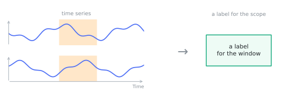
</figure>

## AnswerTask

Free-form text out. With no `prompt`, the task is a caption. With a `prompt`, it answers a question.

```python
from timenet.types import AnswerTask

AnswerTask(
    target=(
        "A 10-second vibration trace with rising amplitude and a periodic "
        "impact after 5 s."
    )
)

AnswerTask(
    prompt="Is the machine healthy?",
    target="No, a bearing fault is present",
)
```

<figure markdown="span">
  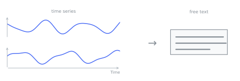
</figure>

<figure markdown="span">
  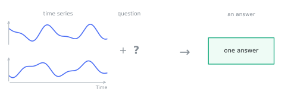
</figure>

If you add a `rationale`, the same task supervises the reasoning and the answer. The field is on the base
class. So this is not a separate type: **any** task can carry a chain of thought.

```python
from timenet.types import AnswerTask, ClassificationTask

base = ClassificationTask(target="faulty", target_schema="condition")

AnswerTask(
    prompt="Does this trace show a bearing fault? Walk through your reasoning.",
    rationale=(
        "The vibration amplitude grows steadily after 5 s and a sharp "
        "impact repeats once per shaft revolution. That periodicity matches "
        "the bearing's ball-pass frequency rather than imbalance, which "
        "would track shaft speed."
    ),
    target="Yes, an outer-race bearing fault",
    from_tasks=(base,),
)
```

<figure markdown="span">
  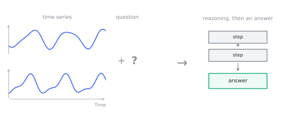
</figure>

## ScalarPredictionTask

One number out. The task keeps the quantity and its physical unit as data. A regression target encoded as
a string in an answer task loses its type. A `float` with a `unit` keeps regression metrics, batching,
and unit-aware conversion simple.

```python
from timenet.types import ScalarPredictionTask, TimeInterval

ScalarPredictionTask(
    target=62.0,
    unit="bpm",
    target_name="mean_heart_rate",
    scope=TimeInterval.seconds(0.0, 30.0),
)
```

<figure markdown="span">
  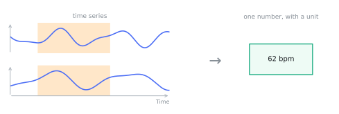
</figure>

## TemporalLocalizationTask

Regions out: find where something happens, from a description of it. This task is the inverse of a scoped
`ClassificationTask`, which supplies the region and asks for its label. One type covers event detection,
segmentation, and change-point detection. They share this target: a tuple of `TimePoint` or
`TimeInterval` spans.

`mode` says whether unmarked time is allowed. `SPARSE` means only the marked spans are claimed (R-peaks).
`EXHAUSTIVE` means the spans must tile the region of interest, and a gap is an error (sleep staging).

```python
from timenet.types import LocalizationMode, TemporalLocalizationTask, TimePoint

TemporalLocalizationTask(
    prompt="Locate all R-peaks in lead II.",
    mode=LocalizationMode.SPARSE,
    target=(
        TimePoint.seconds(1.20, time_series_ids=("II",)),
        TimePoint.seconds(2.05, time_series_ids=("II",)),
    ),
)

TemporalLocalizationTask(
    prompt="Segment the night into sleep stages.",
    mode=LocalizationMode.EXHAUSTIVE,
    # the answer is the stored annotations
    target_annotation_ids=("ann-n2-0007", "ann-n3-0008"),
)
```

<figure markdown="span">
  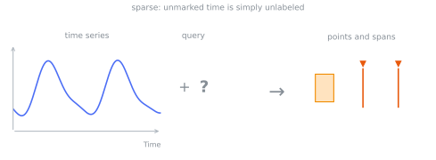
</figure>

<figure markdown="span">
  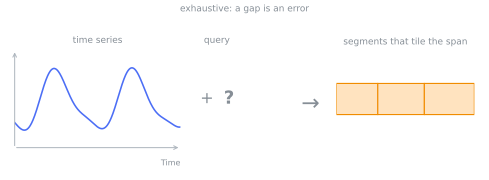
</figure>

## ForecastingTask

Continue the context into the future. The future is either a whole separate record
(`target_record_id`) or a region of the record the task is attached to (`target_span`). The task sets
exactly one, never both and never neither. The record-id form references ids rather than raw arrays, so
context and horizon stay traceable to their dataset versions.

```python
from timenet.types import ForecastingTask

ForecastingTask(
    context_record_ids=("2024-01-01",), target_record_id="2024-01-02"
)
```

`target_span` lets a single unsplit series carry a horizon, so a dataset can ship the raw recording
rather than a context/target pair. It is the region to predict: a `TimeInterval` on the recording
timeline, or a `StepInterval` on an ordinal series. It must be an interval, never a point. A point has
no duration, so it names no values. It needs an explicit `scope` for the context. The default
`scope=None` means the whole record, which includes the region to predict.

```python
from timenet.types import ForecastingTask, TimeInterval

# forecast the last 12 s of a 144 s recording, given the first 132 s as context
ForecastingTask(
    scope=TimeInterval.seconds(0.0, 132.0),
    target_span=TimeInterval.seconds(132.0, 144.0),
)
```

An ordinal series has no clock, so its horizon is named in steps instead. A purely ordinal sequence
(order only, no calendar time) takes its last 12 steps as the horizon, given the first 132 as context:

```python
from timenet.types import ForecastingTask, StepInterval

ForecastingTask(
    scope=StepInterval(time_series_id="sequence", start=0, stop=132),
    target_span=StepInterval(time_series_id="sequence", start=132, stop=144),
)
```

<figure markdown="span">
  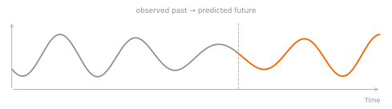
</figure>

## TSEditingTask

A series out: transform the source record into the target record, as the `prompt` instructs. This task
covers denoising, filtering, and deliberate corruption. Both sides of the edit are stored records.

```python
from timenet.types import TSEditingTask

TSEditingTask(
    prompt="Remove the baseline wander.",
    source_record_id="ecg-raw",
    target_record_id="ecg-clean",
)
```

<figure markdown="span">
  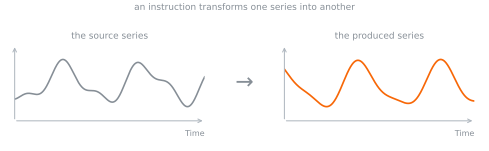
</figure>

## TSGenerationTask

A series out from a text specification alone.

```python
from timenet.types import TSGenerationTask

TSGenerationTask(
    prompt="Generate a 150 bpm sinus-tachycardia ECG, 10 s at 500 Hz.",
    target_record_id="ecg-synth-0001",
)
```

<figure markdown="span">
  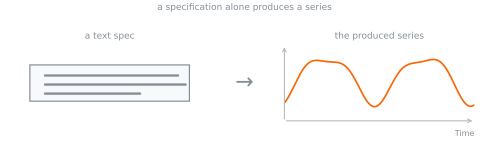
</figure>

## TSCorrespondenceTask

Relate one series to others. The task's `record_ids` are the query. `candidate_record_ids` is the pool
that the answer comes from. `target` names the correct one(s). If you leave the pool empty, the task is
open-ended.

```python
from timenet.types import TSCorrespondenceTask

TSCorrespondenceTask(
    prompt="Which recording is most similar to this one?",
    candidate_record_ids=("rec-a", "rec-b", "rec-c"),
    target=("rec-b",),
)
```

<figure markdown="span">
  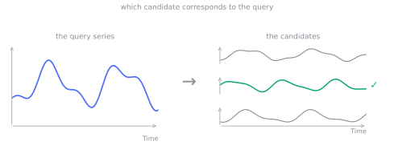
</figure>

## Context or target

You can use an annotation two ways in a task:

- as **context**: something the model reads to help it answer (`input_annotation_ids`), or
- as the **target**: the thing the model must produce (`target_annotation_ids`).

The same annotation can be the context for one task and the target of another. A task gives its answer
either inline in `target` **or** by reference in `target_annotation_ids`, never both. `add_task` rejects a
task that gives both. A pointer to stored annotations avoids a copy of, for example, a night of
sleep-stage intervals in a task row.

Tasks can also build on each other. With `from_tasks`, one task feeds into another. So a simple label can
seed a harder task about the same record. A few basic labels turn into many richer training examples.

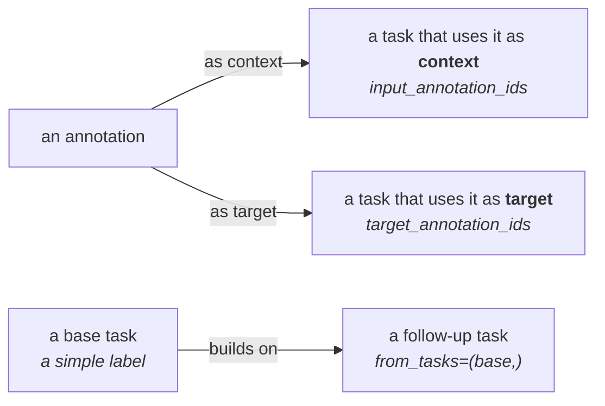
