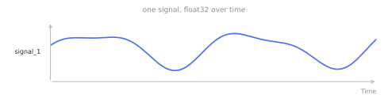

# Time series

A time series is one signal of a [record](records.md): typed values over time. A record carries one
or more time series. Each one has a `time_series_id` (for example, the vibration and temperature signals
of a machine). The [`TimeSeriesSpec`](../types.md) gives the type and the unit of the values. A time
offset is always in microseconds, and a sampling rate is always in hertz. A g-scale accelerometer signal
and a °C temperature signal therefore read through the same API.

<figure markdown="span">
  
</figure>

## Time offsets and timestamps

The docs and the API use two words for time, and they do not mean the same thing.

A **time offset** is a position on the series' own axis: microseconds from the record's relative zero.
Every axis quantity is a time offset. The bounds of a [span](annotations.md) are also time offsets. A
time offset gives the position of a value inside its recording. It says nothing about the calendar day.

A **timestamp** is an absolute point on the wall clock, in Unix microseconds. Exactly one field carries a
timestamp: the `start_time` of a record. The relative zero of the record refers to this `start_time`.

The wall clock therefore enters a dataset one time, and it composes by addition:

```text
value timestamp = record.start_time + value time offset
```

A recording with no known date has time offsets and no timestamps. This is a supported case, not missing
data. A 500 Hz ECG whose source gives no `base_date` sits exactly on its own axis. The question of which
calendar day it fell on has no answer. The format prefers no answer to a fabricated one.

## Reading values

Values load lazily through Apache Arrow. When you open a dataset, TimeNet does not pull every array into
memory. Read a signal with `to_numpy()` or `to_arrow()`:

```python
from timenet.client import TimeNet

dataset = TimeNet().load("chengsenwang/tsqa")
series = dataset.records[0].time_series[0]
values = series.to_numpy()   # a numpy array in the spec's dtype
```

`to_numpy()` raises `TimeFValidationError` if the loaded array contains nulls.
In some cases, the previous conversion lost the distinction between missing values and NaN.
A nullable spec without actual nulls still supports this method. NaN and infinity remain valid values.

For a nullable series, `to_arrow()` keeps nulls exactly. `to_numpy_and_mask()` returns the values and a
validity mask, a boolean array that marks present timesteps:

```python
values, present = series.to_numpy_and_mask()
values[present]      # only the observed timesteps
```

The values array holds zero, false, or an empty string at each missing position.
That placeholder is not an observation. The mask carries that information.

The PyTorch dataset returns the same pair. The item gives `"series"` for the value tensors.
It gives `"series_masks"` for one boolean tensor per series.
A non-nullable series has an all-true mask.

Uniform tensors with empty tasks and annotations support default PyTorch batching.
Variable shapes and custom task or annotation objects need a suitable transform or `collate_fn`,
a function that combines records into a batch.
`batch_size=1` still combines records into a batch and needs the same handling.

## Sharing across records

To share one signal across several records, attach the same `TimeSeries` instance to each. You can also
attach two instances with the same explicit `time_series_id`. The [writer](../timef-writer.md) dedupes by
`time_series_id`. It stores the bytes one time, no matter how many records reference them.
